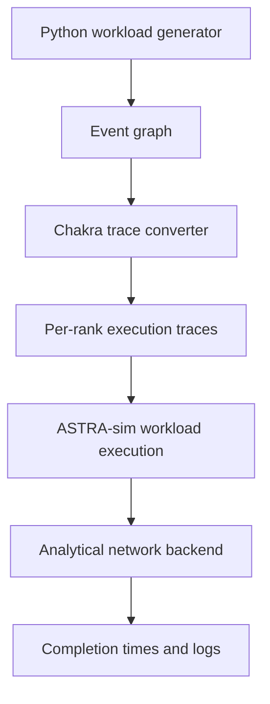
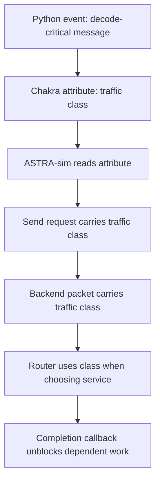

# flowcharts.md

---

## Current

```mermaid
flowchart TD
    A[Python workload generator] --> B[Event graph]
    B --> C[Chakra trace converter]
    C --> D[Per-rank execution traces]
    D --> E[ASTRA-sim workload execution]
    E --> F[Analytical network backend]
    F --> G[Completion times and logs]
```

## TODO

```mermaid
flowchart TD
    A[Python event: decode-critical message] --> B[Chakra attribute: traffic class]
    B --> C[ASTRA-sim reads attribute]
    C --> D[Send request carries traffic class]
    D --> E[Backend packet carries traffic class]
    E --> F[Router uses class when choosing service]
    F --> G[Completion callback unblocks dependent work]
```
